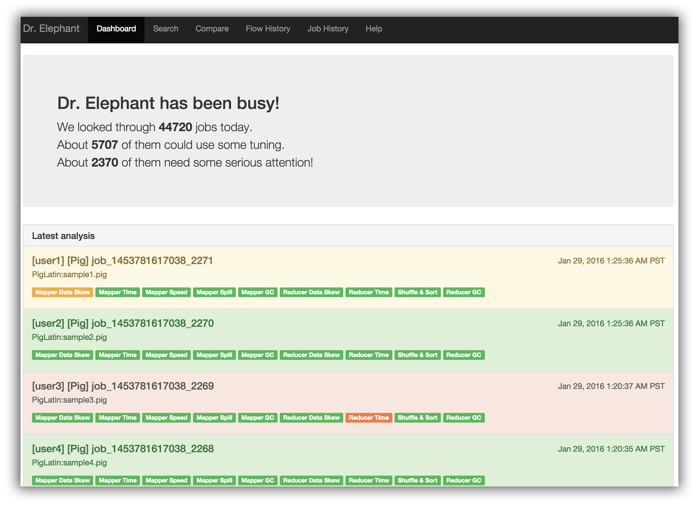
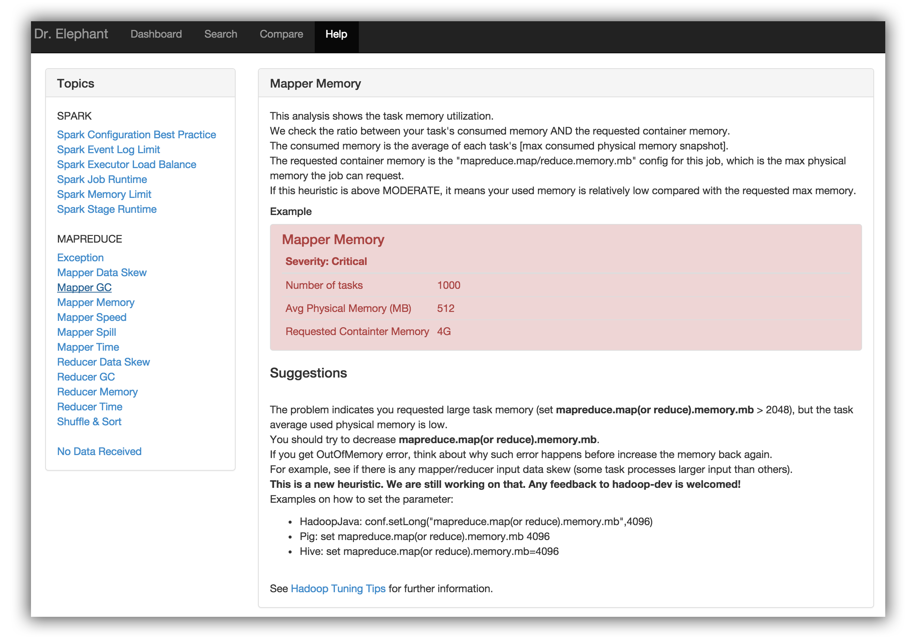

# Dr. Elephant

Dr. Elephant is a performance monitoring and tuning tool for Hadoop. The goal of Dr. Elephant is to improve developer
productivity and increase cluster efficiency by making it easier to tune Hadoop jobs. It analyzes Hadoop jobs using a
set of configurable heuristics that provide insights on how a job performed and uses the results to make suggestions on
how to tune the job to make it perform more efficiently.

## Why Dr. Elephant?
Efficient use of Hadoop cluster resources, and developer productivity, are big problems for users of Hadoop. There are
no actively maintained tools provided by the open source community to bridge this gap. Dr. Elephant, in addition to
solving this problem, is easy to use and extensible.

## Key Features
* Pluggable and configurable Heuristics that diagnose a job
* Integration with Azkaban scheduler and designed to integrate with any hadoop scheduler such as Oozie.
* Representation of historic performance of jobs and flows
* Job level comparison of flows
* Diagnostic heuristics for Map/Reduce and Spark
* Easily extendable to newer job types, applications and schedulers
* Rest API to fetch all the information

## How does it work?
Dr. Elephant gets a list of all recent succeeded and failed applications, once every minute, from the Resource manager.
The metadata for each application, viz, the job counters, configurations and the task data, are fetched from the Job
History server. Once it has all the metadata, Dr. Elephant runs a set of different Heuristics on them and generates a
diagnostic report on how the individual heuristics and the job as a whole performed. These are then tagged with one of
five severity levels, to indicate potential performance problems.

## Use Cases
At Linkedin, developers use Dr. Elephant for a number of different use cases including monitoring how their flow is
performing on the cluster, understanding why their flow is running slow, how and what can be tuned to improve their
flow, comparing their flow against previous executions, troubleshooting etc. Dr. Elephant’s performance green-lighting
is a prerequisite to run jobs on production clusters.

## Sample Job Analysis/Tuning
Dr. Elephant’s home page, or the dashboard, includes all the latest analysed jobs along with some statistics.



Once a job completes, it can be found in the Dashboard, or by filtering on the Search page. One can filter jobs by the
job id, the flow execution url(if scheduled from a scheduler), the user who triggered the job, job finish time, the type
of the job, or even based on severity of the individual heuristics.


The search results provide a high level analysis report of the jobs using color coding to represent severity levels on
how the job and the heuristics performed. The color Red means the job is in critical state and requires tuning while
Green means the job is running efficiently.

## Severity levels

Severity is a measure of the job's performance. It says how severe a job is in terms of efficiency. There are five
severity levels that judge a heuristic/job based on the configured thresholds. The 5 severities in the decreasing order
of severeness are
 
CRTICAL > SEVERE > MODERATE > LOW > NONE

| SEVERITY | COLOR                                   | DESCRIPTION                                        |
| -------- | --------------------------------------- | -------------------------------------------------- |
| CRITICAL |  |  The job is in critical state and must be tuned    |
|  SEVERE  |    |  There is scope for improvement                    |
| MODERATE |  |  There is scope for further improvement            |
|   LOW    |       |  There is scope for few minor improvements         |
|   NONE   |      |  The job is safe. No tuning necessary              |

Once one filters and identifies one’s job, one can click on the result to get the complete report. The report includes
details on each of the individual heuristics and a link, [Explain], which provides suggestions on how to tune the job to
improve that heuristic.




## Heuristics
One can go to the help page in Dr. Elephant to see what each of the heuristics mean. For more information on the
Heuristics, one can refer to the complete documentation here <link>.

## Dr. Elephant Setup

### Compiling & testing locally

#### Play Setup - One time
* To be able to build & run the application, download and install [Play framework 2.2.2](http://downloads.typesafe.com/play/2.2.2/play-2.2.2.zip).
* The pre-installed play command on our boxes will not work as it is configured to look at LinkedIns repos.
* Add the Play installation directory to the system path.

#### Hadoop Setup - One time
* Setup hadoop locally. You can find instructions to setup a single node cluster [here](http://hadoop.apache.org/docs/current/hadoop-project-dist/hadoop-common/SingleCluster.html).
* Export variable HADOOP\_HOME if you haven't already.  
```
export HADOOP\_HOME=/path/to/hadoop/home
export HADOOP\_CONF\_DIR=$HADOOP_HOME/etc/hadoop
```

* Add hadoop to the system path because dr-elephant uses _'hadoop classpath'_ to load the right classes.  
```
export PATH=$HADOOP_HOME/bin:$PATH
```

#### Mysql Setup - One time
* Set up and start mysql locally on your box.
* Create a database called 'drelephant'. Use root with no password.  
```
mysql -u root -p
mysql> create database drelephant;
```

#### Dr. Elephant Setup
* Start Hadoop and run the history server.
* To compile dr-elephant, run the compile script. A zip file is created in the 'dist' directory.  
```
./compile.sh
```
* Unzip the zip file in dist and change to the dr-elephant release directory created. Henceforth we will refer this as DR_RELEASE.  
```
cd dist; unzip dr-elephant\*.zip; cd dr-elephant\*
```
* If you are running dr-elephant for the first time after creating the database, you need to enable evolutions. To do so append _-Devolutionplugin=enabled_ and _-DapplyEvolutions.default=true_ to jvm\_props in elephant.conf file.  
```
vim ./app-conf/elephant.conf
jvm\_props="... -Devolutionplugin=enabled -DapplyEvolutions.default=true"
```
* To start dr-elephant, run the start script specifying a path to the application's configuration files.  
```
$DR\_RELEASE/bin/start.sh $DR\_RELEASE/../../app-conf
```
* To stop dr-elephant run,  
```
$DR\_RELEASE/bin/stop.sh
```
* The dr-elephant logs are generated in the 'dist' directory besides the dr-elephant release.  
```
less $DR\_RELEASE/../logs/elephant/dr_elephant.log
```

### DB Schema evolutions

When the schema in the model package changes, run play to automatically apply the evolutions.

* There is a problem with Ebean where it does not support something like @Index to generate indices for columns of interest
* So what we did to work around this is to manually add indices into the sql script.
* To do this, we needed to prevent the automatically generated sql to overwrite our modified sql.
* The evolution sql file must be changed (by moving or removing the header "To stop Ebean DDL generation, remove this comment and start using Evolutions") to make sure it does not automatically generate new sql.
* To re-create the sql file from a new schema in code:
    * Backup the file at ./conf/evolutions/default/1.sql
    * Remove the file
    * Run play in debug mode and browse the page. This causes EBean to generate the new sql file, and automatically apply the evolution.
    * Copy over the indices from the old 1.sql file
    * Remove the header in the sql file so it does not get overwritten
    * Browse the page again to refresh the schema to add the indices.

### Deployment on the cluster

* SSH into the cluster machine.
* Switch user to _'elephant'_  
```
sudo -iu elephant
```
* Change directory to elephant.  
```
cd /export/apps/elephant/
```
* Unzip the dr-elephant release and change directory to it.
* To start dr-elephant run the start script. The start script takes an optional argument to the application's conf directory. By default it uses _'/export/apps/elephant/conf'_   
```
./bin/start.sh
```
* To stop dr-elephant run,  
```
./bin/stop.sh
```
* To deploy new version, be sure to kill the running process first

### Adding new heuristics

* Create a new heuristic and test it.
* Create a new view for the heuristic for example helpMapperSpill.scala.html
* Add the details of the heuristic in the HeuristicConf.xml file.
    * The HeuristicConf.xml file requires the following details for each heuristic:
        * **applicationtype**: The type of application analysed by the heuristic. e.g. mapreduce or spark
        * **heuristicname**: Name of the heuristic.
        * **classname**: Fully qualified name of the class.
        * **viewname**: Fully qualified name of the view.
        * **hadoopversions**: Versions of Hadoop with which the heuristic is compatible.
    * Optionally, if you wish to override the threshold values of the severities used in the Heuristic and use custom
      threshold limits, you can specify them in the HeuristicConf.xml between params tag. See examples below.
* A sample entry in HeuristicConf.xml would look like,  
```
<heuristic>
    <applicationtype>mapreduce</applicationtype>
    <heuristicname>Mapper GC</heuristicname>
    <classname>com.linkedin.drelephant.mapreduce.heuristics.MapperGCHeuristic</classname>
    <viewname>views.html.help.mapreduce.helpGC</viewname>
</heuristic>
```
* A sample entry showing how to override/configure severity thresholds would look like,
```
<heuristic>
    <applicationtype>mapreduce</applicationtype>
    <heuristicname>Mapper Data Skew</heuristicname>
    <classname>com.linkedin.drelephant.mapreduce.heuristics.MapperDataSkewHeuristic</classname>
    <viewname>views.html.help.mapreduce.helpMapperDataSkew</viewname>
    <params>
      <num\_tasks\_severity>10, 50, 100, 200</num\_tasks\_severity>
      <deviation\_severity>2, 4, 8, 16</deviation\_severity>
      <files\_severity>1/8, 1/4, 1/2, 1</files\_severity>
    </params>
</heuristic>
```
* Run Doctor Elephant, it should now include the new heuristics.

## Project Structure

    app                             → Contains all the source files
     └ com.linkedin.drelepahnt      → Application Daemons
     └ org.apache.spark             → Spark Support
     └ controllers                  → Controller logic
     └ models                       → Includes models that Map to DB
     └ views                        → Page templates

    app-conf                        → Application Configurations
     └ elephant.conf                → Port, DB, Keytab and other JVM Configurations (Overrides application.conf)
     └ FetcherConf.xml              → Fetcher Configurations
     └ HeuristicConf.xml            → Heuristic Configurations
     └ JobTypeConf.xml              → JobType Configurations

    conf                            → Configurations files
     └ evolutions                   → DB Schema
     └ application.conf             → Main configuration file
     └ log4j.properties             → log configuration file
     └ routes                       → Routes definition

    public                          → Public assets
     └ assets                       → Library files
     └ css                          → CSS files
     └ images                       → Image files
     └ js                           → Javascript files

    scripts
     └ start.sh                     → Starts Dr. Elephant
     └ stop.sh                      → Stops Dr. Elephant

    test                            → Source folder for unit tests

    compile.sh                      → Compiles the application

## License

    Copyright 2016 LinkedIn Corp.

    Licensed under the Apache License, Version 2.0 (the "License"); you may not
    use this file except in compliance with the License. You may obtain a copy of
    the License at

    http://www.apache.org/licenses/LICENSE-2.0

    Unless required by applicable law or agreed to in writing, software
    distributed under the License is distributed on an "AS IS" BASIS, WITHOUT
    WARRANTIES OR CONDITIONS OF ANY KIND, either express or implied. See the
    License for the specific language governing permissions and limitations under
    the License.